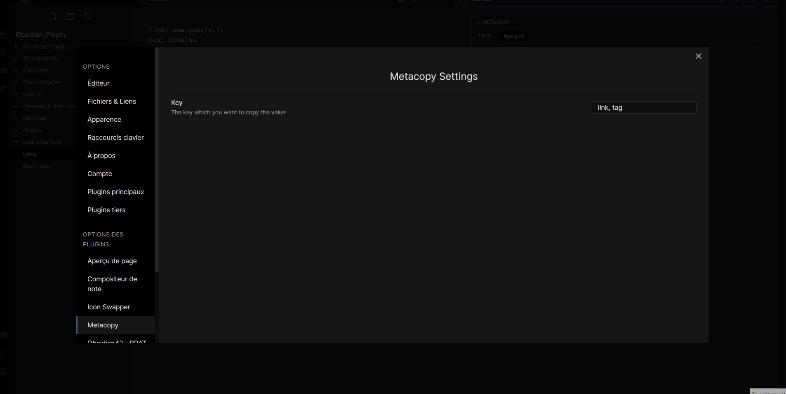

# Obsidian — MetaCopy

The purpose of this plugin is to get quickly the value of a frontmatter key. You can set multiple value in settings, as : `key1, key2, key3, ...`

If the plugin found multiple key in the frontmatter : 
1. The context take the **first** value from the frontmatter. 
2. The command create a menu where you can choose the value you want. 

The value is added in your pasteboard, so you can paste it everywhere. 

Yeah. That's it.

Here the plugin in action : 

The plugin is inspired by [Copy Publish URL](https://github.com/kometenstaub/copy-publish-url) but for all link (instead of only publish).
